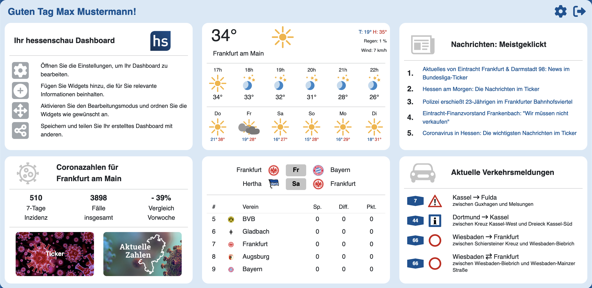

# Backend hs-Dashboard

Hochschule RheinMain - Medieninformatik - Bachelorarbeit von Sandra Kiefer

"Plattform zur interaktiven Erstellung personalisierter Dashboards für die integrierte Visualisierung mehrerer Datenquellen"

Referent "Prof. Dr. Wolfgang Weitz" – Korreferent "Prof. Dr. Jörg Berdux" – Externer Betreuer "John-Patrick Rott (M.Sc.) vom Hessischen Rundfunk"

Implementierung des Backends mit [Spring Boot](https://spring.io/projects/spring-boot) und [Gradle](https://gradle.org/)



## Installation

Starten der Backend-Anwendung

```bash
  ./gradlew bootRun
```

Bauen der Backen-Anwendung

```bash
  ./gradlew build
```

Übersicht aller verfügbaren Kommandos

```bash
  ./gradlew tasks
```

Das Backend ist dann unter [localhost:9090](http://localhost:9090) zu erreichen.

## Kurzbeschreibung der Bachelorarbeit

Ziel der Bachelorarbeit ist es eine Plattform zur interaktiven Erstellung persoalisierter Dashboards für die integrierte Viesualisierung mehrerer Datenquellen zu design und zu implementieren. Dies wird anhand des Beispiels für die Webseite [hessenschau.de](https://www.hessenschau.de/index.html) gezeigt. Bei den zu visualisierenden Datenquellen handelt es sich um verschiedenen Wetterdaten, Coronazahlen, Sportdaten, Verkehrsdaten und Nachrichten. Diese werden kompakt und übersichtlich indivduell anpassbar im Dashboard angezeigt. Die Nutzer haben dabei die Möglichkeit ihre verschiedenen Dashboards nach ihren Bedürfnissen anzupassen. 

## API Übersicht

Über die verschiedenen beschriebenen REST-Schnittstellen wird die Kommunikation zwischen Frontend und Backend realisiert. 


### Daten Schnittstellen

Zugriff und Abfrage der verschiedenen aufbereiteten Daten.
Zur Authentifizierung der Anfragen muss immer ein gültiges JWT Token mitgesendet werden (wird bei erfolreichem Login übermittelt).

| Parameter | Typ      | Beschreibung               |
| :-------- | :------- | :------------------------- |
| `jwt_token` | `string` | JWT Token zur Authentifizierung der Anfrage |

#### Wetter

```http
  GET /api/weather/{location}
  GET /api/weather/locations
```
| Parameter | Typ      | Beschreibung               |
| :-------- | :------- | :------------------------- |
| `location` | `string` | Landkreis in Hessen |

#### Biowetter

```http
  GET /api/bioweather/{categories}
  GET /api/bioweather/categories
```
| Parameter | Typ      | Beschreibung               |
| :-------- | :------- | :------------------------- |
| `categories` | `string[]` | Biowetterkategorie |

#### Pollenflug

```http
  GET /api/pollen/{location}/{types}
  GET /api/pollen/locations
  GET /api/pollen/pollentypes
```
| Parameter | Typ      | Beschreibung               |
| :-------- | :------- | :------------------------- |
| `location` | `string` | Landkreis in Hessen |
| `types` | `string[]` | Pollenart |

#### Corona

```http
  GET /api/corona/{location}
  GET /api/corona/locations
```
| Parameter | Typ      | Beschreibung               |
| :-------- | :------- | :------------------------- |
| `location` | `string` | Landkreis in Hessen |

#### Nachrichten

```http
  GET /api/news/latest
  GET /api/news/most
```

#### Straßenverkehr

```http
  GET /api/traffic/streets/{streets}
  GET /api/traffic/streets/A
  GET /api/traffic/streets/B
```
| Parameter | Typ      | Beschreibung               |
| :-------- | :------- | :------------------------- |
| `streets` | `string[]` | Autobahnen und Bundesstraßen |

#### Sport

```http
  GET /api/sport/{leagueShortcut}/{team}
  GET /api/sport/{leagueShortcut}/teams
```
| Parameter | Typ      | Beschreibung               |
| :-------- | :------- | :------------------------- |
| `leagueShortcut` | `string` | Ligakürzel (OpenLigaDB) |
| `team` | `string` | Name des Teams |

### Authentifizierung Schnittstellen

Schnittstellen zur Registrierung und Anmeldung von Nutzern.

#### Registrierung

```http
  POST /api/auth/signup
```
| Parameter | Typ      | Beschreibung               |
| :-------- | :------- | :------------------------- |
| `SignUpRequest` | `SignUpRequest` | Objekt welches die benötigten Informationen zur Registrierung beinhaltet |

#### Anmeldung

```http
  POST /api/auth/signin
```
| Parameter | Typ      | Beschreibung               |
| :-------- | :------- | :------------------------- |
| `SignInRequest` | `SignInRequest` | Objekt welches die benötigten Informationen zur Anmeldung beinhaltet |

Bei erfolgreicher Anmeldung wird ein JWT Token zurückgegeben, welches für die Authentifizierung der weiteren Anfragen immer mitgeschickt werden muss.

### Nutzer Schnittstellen

Zugriff und Abfrage der verschiedenen Daten eines Nutzers.
Zur Authentifizierung der Anfragen muss immer ein gültiges JWT Token mitgesendet werden (wird bei erfolreichem Login übermittelt).

| Parameter | Typ      | Beschreibung               |
| :-------- | :------- | :------------------------- |
| `jwt_token` | `string` | JWT Token zur Authentifizierung der Anfrage |

```http
  GET /api/user/timeslots
  PUT /api/user/timeslots
  GET /api/user/displaytime/{id}
  GET /api/user/name
  GET /api/user/role
```

| Parameter | Typ      | Beschreibung                      |
| :-------- | :------- | :-------------------------------- |
| `id`      | `number` | Dashboard-ID |
| `timeslots`      | `TimeSlot[]` | Liste an Zeistpannen welche aktualisiert werden sollen |

### Dashboard Schnittstellen

Zugriff und Abfrage der verschiedenen Daten der Dashboards eines Nutzers.
Zur Authentifizierung der Anfragen muss immer ein gültiges JWT Token mitgesendet werden (wird bei erfolreichem Login übermittelt).

| Parameter | Typ      | Beschreibung               |
| :-------- | :------- | :------------------------- |
| `jwt_token` | `string` | JWT Token zur Authentifizierung der Anfrage |

```http
  PUT    /api/dashboard/start
  GET    /api/dashboard/{id}
  POST   /api/dashboard/new?name={name}
  PUT    /api/dashboard/edit
  POST   /api/dashboard/import
  DELETE /api/dashboard/delete/{id}
  GET    /api/dashboard/all
  GET    /api/dashboard/current
```

| Parameter | Typ      | Beschreibung                      |
| :-------- | :------- | :-------------------------------- |
| `id`      | `number` | Dashboard-ID |
| `name`      | `string` | Name für das neue Dashboard |
| `dashboard`      | `Dashboard` | Dashboard welches geändert/aktualisiert werden soll |

## Verweis Bachelorarbeit für Softwarearchitektur

Für eine genauere und detailreichere Beschreibung über den Aufbau des Backends lesen Sie in der Bachelorarbeit Kapitel 4 nach.

