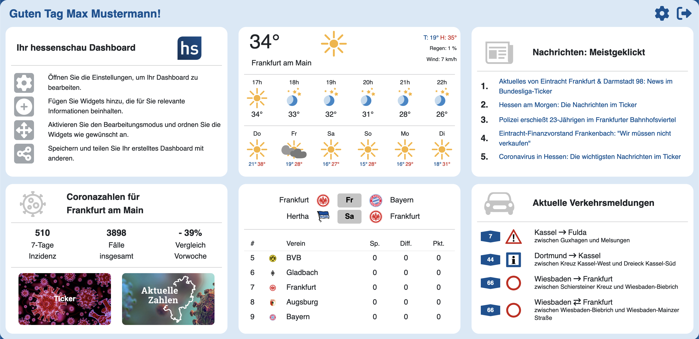

# Frontend hs-Dashboard

Hochschule RheinMain - Medieninformatik - Bachelorarbeit von Sandra Kiefer

"Plattform zur interaktiven Erstellung personalisierter Dashboards für die integrierte Visualisierung mehrerer Datenquellen"

Referent "Prof. Dr. Wolfgang Weitz" – Korreferent "Prof. Dr. Jörg Berdux" – Externer Betreuer "John-Patrick Rott (M.Sc.) vom Hessischen Rundfunk"

Implementierung des Frontends mit [Vue 3](https://vuejs.org/) mit [Vite](https://vitejs.dev/) und [npm](https://www.npmjs.com/)



## Installation

Notwendige Pakete installieren

```bash
  npm install
```

Starten der Frontend-Anwendung

```bash
  npm run dev
```

Bauen der Frontend-Anwendung

```bash
  npm run build
```

Das Frontend ist dann unter [localhost:3000](http://localhost:3000) zu erreichen.

## Kurzbeschreibung der Bachelorarbeit

Ziel der Bachelorarbeit ist es eine Plattform zur interaktiven Erstellung persoalisierter Dashboards für die integrierte Viesualisierung mehrerer Datenquellen zu design und zu implementieren. Dies wird anhand des Beispiels für die Webseite [hessenschau.de](https://www.hessenschau.de/index.html) gezeigt. Bei den zu visualisierenden Datenquellen handelt es sich um verschiedenen Wetterdaten, Coronazahlen, Sportdaten, Verkehrsdaten und Nachrichten. Diese werden kompakt und übersichtlich indivduell anpassbar im Dashboard angezeigt. Die Nutzer haben dabei die Möglichkeit ihre verschiedenen Dashboards nach ihren Bedürfnissen anzupassen. 

## Nutzer zum Testen der Anwendung

| E-Mail | Passwort      | Rolle               |
| :-------- | :------- | :------------------------- |
| `ff@test.de` | `FFtestPW!?17` | Nutzer |
| `mm@test.de` | `MMtestPW!?17` | Admin/Redakteur |

## Verweis Bachelorarbeit für Softwarearchitektur

Für eine genauere und detailreichere Beschreibung über den Aufbau des Frontends lesen Sie in der Bachelorarbeit Kapitel 4 nach.

